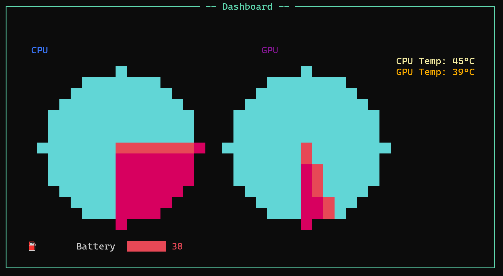

# 🖥️ TerminalUI Dashboard

A *fancy terminal application* written in C# that displays real-time **CPU/GPU usage, temperatures, and battery status** using [Spectre.Console](https://spectreconsole.net/) and [LibreHardwareMonitor](https://github.com/LibreHardwareMonitor/LibreHardwareMonitor).

---

## 🚀 Features

- ✅ CPU usage (%)
- ✅ GPU usage (%)
- ✅ CPU temperature (°C)
- ✅ GPU temperature (°C)
- ✅ Battery percentage
- ✅ Live terminal UI with gauges and meters

---

## 📸 Screenshot

*(add a screenshot of your terminal UI here)*



---

## 🛠️ Installation
1. Clone this project:

```bash
git clone https://github.com/EmirMurat6606/TerminalUI
cd TerminalUI
```
2. Install the required dotnet packages:
```bash
dotnet add package Spectre.Console
dotnet add package LibreHardwareMonitorLib
```
3. Build and run
```bash
dotnet run
```
---

## Remarks

When running the application, you have to wait a couple of seconds

before the statistics start to display.